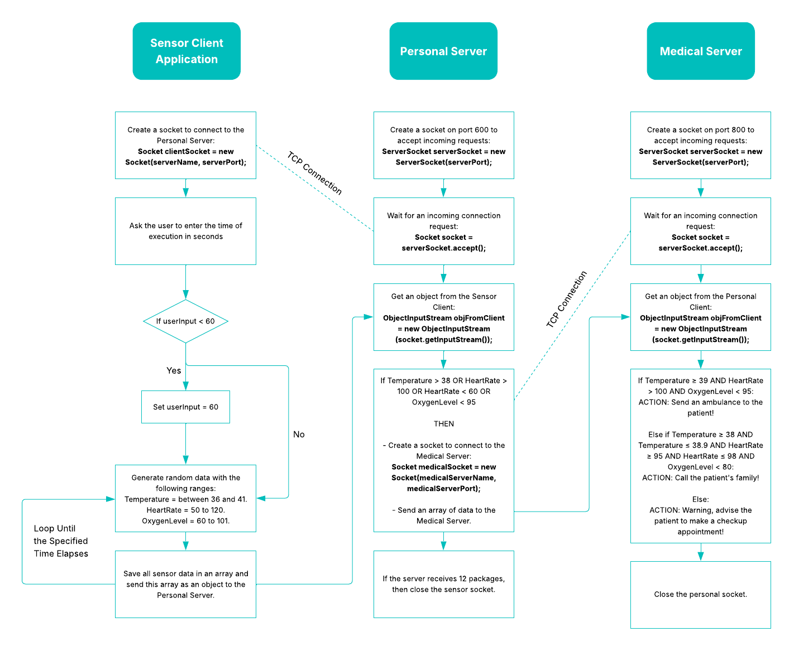

# 🫀 Remote Health Monitoring System
The Remote Health Monitoring System (RHMS) is a Java-based client-server application designed to monitor and manage patients' health data remotely. It simulates real-time data transmission between a patient device (client) and a central medical server.

By using classical TCP socket programming and a user-friendly Java Swing GUI, this system demonstrates how remote health tracking can be implemented effectively for chronic illness management and emergency response.

## 📈 Interaction Diagram

  <picture>
    <source srcset="Repository_Assets/Interaction_Diagram_Dark.png" media="(prefers-color-scheme: dark)">
    <source srcset="Repository_Assets/Interaction_Diagram_Light.png" media="(prefers-color-scheme: light)">
    
  </picture>

## 🧠 System Architecture

The application follows a modular, client-server design:

- **Client (Sensor Device):** Simulates patient-side sensors and transmits data.
- **Personal Server:** Acts as the decision-maker, evaluating incoming data.
- **Medical Server:** Receives abnormal health readings and handles alerts/logs.

All components communicate using TCP sockets to ensure reliable, ordered data transfer.

## 📷 Screenshots

<b>Figure 1:</b> Sensor Client Application Interface.

  

<b>Figure 1:</b> Get Input Interface

  

<b>Figure 1:</b> Show Data Interface

## 👨‍💻 Authors
- Reem Saleh Saeed Al Malki
- Asail Mashhour Al Amoudi
- Mayar Mohammed Al Swill
- Hadeel Abdullah Abuhamous
- Reema Raddad Al Malki
- Lujain Abdulaziz Al Sulami 
